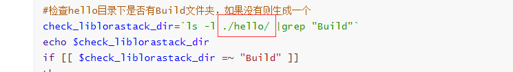
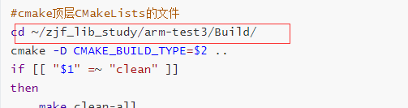
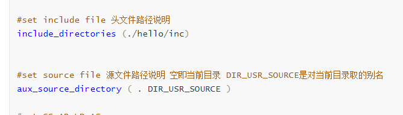
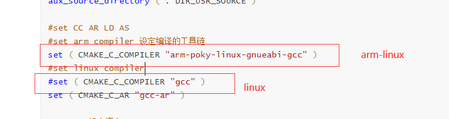
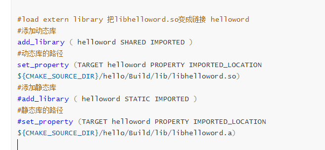
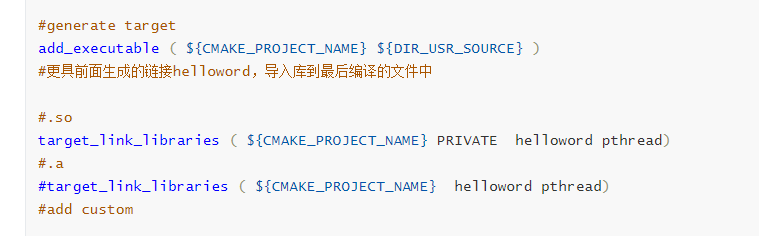
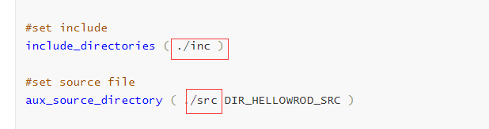
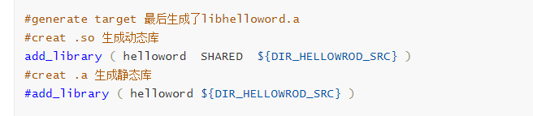

## helloworld

当前工程git clong ：

```
http://git.linkortech.com:10020/NO.14/HelloWorld
```

**简单说明**

```
一个基本的基于shell脚本与README实现的在linux下运行的helloworld工程C语言工程
```

## 工程结构说明

OPC UA + MQTT 的通用数据采集框架研究

### 1、文件说明

a)     build_project.sh 整体构建脚本，用法如下

i.      ./build_project.sh //默认编译

ii.     ./build_project.sh clean // 清除工程

iii.    ./build_project.sh build Debug //编译（增量/全量自动  暂时没有）

b)     cleartmp.py 清除所有Build目录下的内容

c)     CMakeLists.txt 构建可执行应用的cmake文件

d)     env_linux_arm.sh 用于设置交叉编译环境

e)     env_linux.sh 用于设置本地编译环境

g）  git_push.sh 用于上传代码到gitlab的远程厂库

### 2、目录说明

- ​     doc: 存放开发文档，包括研究，特性，学习记录等，可供大家学习

- ​     zjf:存放建福的个人的测试工程
- ​     xxx：其他开发人员也在当前目录下传教自己的名字缩写的目录，然后上传自己的测试工程

### 3、使用说明

通过系统环境变量来设置CMake中使用的一些变量，例如工程中的：

a)     env_linux.sh 本机编译使用，用法如下：

```
source  env_linux.sh
```

b)     env_linux_arm.sh 交叉编译使用 

```
source env_linux_arm.sh
```

**##特别注意##**

```
 切换嵌入式环境变量后，需要执行./build_xdatacollecter.sh clean 再编译。每次都要编译前都要 
 造成问题的原因还不知道。目前按照这个方式就可以正常的进行交叉编译
```

打开相关的文件即可了解环境变量的设置

交叉编译中有个很重要的参数 --sysroot 指定的库路径，基本就是glibc

我的虚拟机是这个路径,交叉编译的一些第三方的库全部都放到这目录下.

```
/opt/fsl-imx-x11/4.1.15-2.1.0/sysroots/cortexa7hf-neon-poky-linux-gnueabi/usr/lib
```

首先配置环境变量

```
source env_linux.sh
```

执行编译

```
编译并且正常运行
./build_project.sh 
运行脚本						参数1
```

```
清除所有编译文件
./build_project.sh clean
运行脚本		     参数1
```


## 文件说明

#### 脚本文件

##### 使用方法

```Shell
清空Build目录下的编译文件
sh build_hello_test.sh clean
在Build目录下生成编译文件
sh build_hello_test.sh
最终生成的目标文件都放在Build/bin目录下
```

##### 使用注意事项





如果构建新的README工程，需要注意这几处的路径。

##### 脚本源码

```Shell
#!/bin/bash
echo "=======================Bulid HELLOWORD Test================="
#检查当前目录下是否有生成用于存放编译文件的Bulid文件夹，如果已经有了就跳过
check_build_dir=`ls -l |grep "Build"`
echo $check_build_dir
if [[ $check_build_dir =~ "Build" ]]
then
	echo "Has Bulid Directroy!"
else
	echo "Create Build Directory!"
	mkdir Build
fi
#检查hello目录下是否有Build文件夹，如果没有则生成一个
check_liblorastack_dir=`ls -l ./hello/ |grep "Build"`
echo $check_liblorastack_dir
if [[ $check_liblorastack_dir =~ "Build" ]]
then
	echo "Has lorastack build Directory"
else
	echo "Create lorastack Build Directory"
	mkdir ./hello/Build
fi
#把输入的参数打印出来 脚本的参数是在脚本名后用空格区分的 sh build_hello_test.sh 1 Debug
echo "$1"
echo "$2"
echo "$3"
#在./hello/Build执行README这样就回把全部编译的文件都放到了该目录下
cd ./hello/Build
README -D README_BUILD_TYPE=$2 ..
if [[ "$1" =~ "clean" ]]
then
	make clean-all
else
	echo "====================================....Build helloword start....====================================="
	make
	echo "====================================....Build helloword end....======================================="
fi
#README顶层READMELists的文件
cd ~/zjf_lib_study/arm-test3/Build/
README -D README_BUILD_TYPE=$2 ..
if [[ "$1" =~ "clean" ]]
then
	make clean-all
	#rm -rf ./*
	#clear swp
	#cd ~/linux-test3/
#范工这里还有一些额外操作目前我用不到
	#clear html
	#check_dox_html=`ls -l ./doc/ |grep "html"`
	#echo $check_dox_html
	#if [[ $check_dox_html =~ "html" ]]
	#then
	#	rm -rf ./doc/html
	else
	#fi

	#python version
	#python -V
	#rtn="$?"
	#if [[ $rtn == "0" ]]
	#then
	#	echo "python"
	#	python cleartmp.py
	#else
	#	echo "python3"
	#	python3 cleartmp.py
	#fi

	#echo $check_python_ver
	echo "====================================....clean Success....========================================="
else
	echo "====================================....Build start....==============================================="
	make
	echo "generate stacktest at ./Build/bin/"
	echo "====================================....Build Success....========================================="
fi

echo "press anykey to exit"
read input


```


#### 顶层READMELists文件说明

##### 使用注意事项

配置源码文件路径



配置编译链



配置链接库（动态和静态）



最终可执行文件



##### READMEList文件源码

```cmake
#README version 说明README的版本
README_minimum_required ( VERSION 2.8 )
#最终生成可执行文件的名字
project ( project_hello )  
#The name of the operating system for which README is to build.
SET(README_SYSTEM_NAME Linux)

#设置输出文件的存放位置 README_BINARY_DIR是README语句执行当前路径 这里我们是在脚本中执行的目录是对应的Build文件夹
set ( EXECUTABLE_OUTPUT_PATH ${README_BINARY_DIR}/bin )
set ( LIBRARY_OUTPUT_PATH ${README_BINARY_DIR}/bin )
#这个不太知道
set ( README_SHARED_LIBRARY_LINK_C_FLAGS )

#set include file 头文件路径说明
include_directories (./hello/inc)


#set source file 源文件路径说明 空即当前目录 DIR_USR_SOURCE是对当前目录取的别名
aux_source_directory ( . DIR_USR_SOURCE )

#set CC AR LD AS
#set arm compiler 设定编译的工具链
set ( README_C_COMPILER "arm-poky-linux-gnueabi-gcc" )
#set linux compiler
#set ( README_C_COMPILER "gcc" )
set ( README_C_AR "gcc-ar" )

#CFLAGS 设定语言
set ( README_C_FLAGS "-g -std=c++11 -pthread" )

#set debug 这里的README_BUILD_TYPE在脚本中有赋值的

if(README_BUILD_TYPE STREQUAL Debug)
	add_definitions (
		-DPRINT_DEBUG_INFO
		-DLORA_SOCKET_SIM
	)
endif()
 
#load extern library 把libhelloword.so变成链接 helloword
#添加动态库
add_library ( helloword SHARED IMPORTED )
#动态库的路径
set_property (TARGET helloword PROPERTY IMPORTED_LOCATION ${README_SOURCE_DIR}/hello/Build/lib/libhelloword.so)
#添加静态库
#add_library ( helloword STATIC IMPORTED )
#静态库的路径
#set_property (TARGET helloword PROPERTY IMPORTED_LOCATION ${README_SOURCE_DIR}/hello/Build/lib/libhelloword.a)


#generate target
add_executable ( ${README_PROJECT_NAME} ${DIR_USR_SOURCE} )
#根据前面生成的链接helloword，导入库到最后编译的文件中

#.so动态库链接方式
target_link_libraries ( ${README_PROJECT_NAME} PRIVATE  helloword pthread)
#.a静态库链接方式
#target_link_libraries ( ${README_PROJECT_NAME}  helloword pthread)
#add custom

add_custom_target ( clean-all COMMAND rm -rf {README_BINARY_DIR}/* )

```

#### 驱动层面的READMELists文件

##### 使用注意事项

配置源码路径



配置编译链


配置生成那种库（动态或静态）



##### READMEList文件源码

```cmake
#set version
README_minimum_required ( VERSION 2.8 )

#project
project ( hellowordlib )

#The name of the operating system for which README is to build.
SET(README_SYSTEM_NAME Linux)

#设置输出文件的存放位置 README_BINARY_DIR是README语句执行当前路径 这里我们是在脚本中执行的目录是对应的Build文件夹
set ( EXECUTABLE_OUTPUT_PATH ${README_BINARY_DIR}/bin )
set ( LIBRARY_OUTPUT_PATH ${README_BINARY_DIR}/lib )


#set include 
include_directories ( ./inc )

#set source file
aux_source_directory ( ./src DIR_HELLOWROD_SRC )

#set CC AR
set (README_C_COMPILER "arm-poky-linux-gnueabi-gcc")
#set linux compiler
#set ( README_C_COMPILER "gcc" )
set (README_C_AR "gcc-ar")

#set cflags //zjf:what？
set (README_C_FLAGS "-g -std=c++11 -pthread")

if(README_BUILD_TYPE STREQUAL Debug)
	add_definitions(
		-DPRINT_DEBUG_INFO
		-DLORA_SOCKET_SIM
		)
endif()

#generate target 最后生成了libhelloword.a
#creat .so 生成动态库
add_library ( helloword  SHARED  ${DIR_HELLOWROD_SRC} )
#creat .a 生成静态库
#add_library ( helloword ${DIR_HELLOWROD_SRC} )

#add custom 
add_custom_target ( clean-all COMMAND rm -rf ${README_BINARY_DIR}/* )

```

### Astyle linux下整理代码格式

##### 使用方法，

```shell
#执行该脚本，就会将但其目录下，及次级目录下的.C .H文件安装既定的规则整理好格式
sh astyle.sh
a
```

##### astyle.sh

```shell
#!/bin/bash
for f in $(find . -name '*.c' -or -name '*.cpp' -or -name '*.h' -type f)
	do
			 astyle --style=ansi -s4 -S  -p  -D   -m0 -M40 --convert-tabs --suffix=.pre $f
	done

# after formate the code,we need to rm '*.orig' files
for f in $(find . -name '*.orig' -type f)
	do
			rm $f
	done

```

##### 安装教程

 https://blog.csdn.net/shawhe/article/details/13770643 


## 2022.5.5更新 修改为任务队列的测试工程

